# Personal AI Development Environment

If you're the kind of person that likes tweaking your dotfiles, your tmux config, your vim setup, your VS Code plugins--this is maybe the most fun you'll ever have building something. It's the first time I've felt a sustained flow state while coding with AI.

The goal is to create a personalized AI-powered development environment.
Something that works the way _you_ want it to.

This project is released as Open Prompt, rather than Open Source. There are a few reasons:
* You'll have more fun this way
* My code is hyper-tailored to my own needs
* and it's vibecoded mess that happens to mostly work

You don't want my vibecoded mess. You want *your* vibecoded mess, whose intricacies and quirks and powers only you know.

-------

You can start by giving this README to the coding agent of your choice. Just paste the URL and hit go I guess.

It'll probably do something like:
* Read AGENTS.md
* Read architecture.md
* Send out subagents for each of the subpages
* Make you a ~~fully~~ ~~semi~~ probably not yet functional but very ambitious AI-powered development environment

You can wiggum it from there.

-------

*What's really fun* is that once the app is semi-functional, you can live-code it while you're using it.
You can just say "reskin to 1990s hacker style" and watch it morph in real time.

I've tried to architect things to make this easier:
all the pages run as separate apps, so you can muck around with one part without breaking everything.

If you're a human you should also read
[MANUAL.md](MANUAL.md) and learn about a few things you'll have to do by hand. And security. Please think of the security.
In case you think security doesn't really matter, here's me catching the agent backdooring its way into the app so it could take
the screenshots below:

good luck have fun

## Features

### Conversations

Chat UI for creating and streaming agent conversations using the [OpenHands SDK](https://github.com/OpenHands/software-agent-sdk).

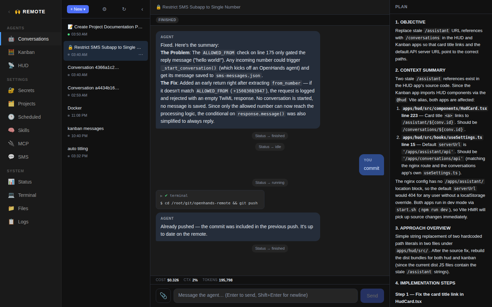

### Kanban

Kanban board of conversations organized by project and execution status.

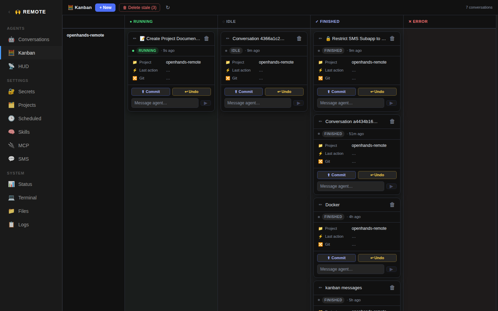

### HUD

Draggable card dashboard for monitoring live conversations in real time.

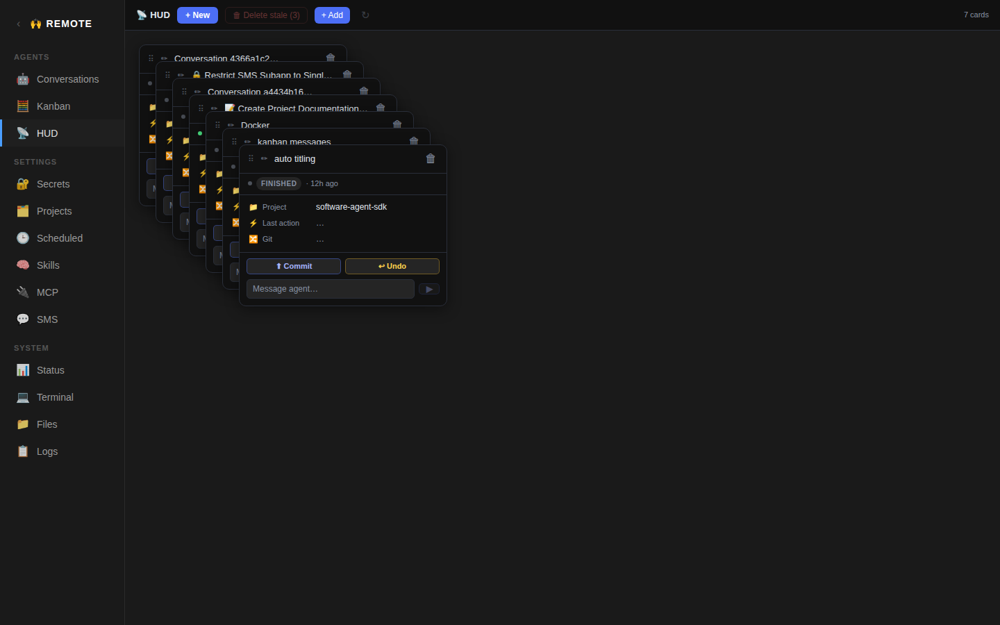

### LLM

Settings page for choosing an LLM provider, model, and API key.

### Secrets

Key-value secret store injected into new conversations.

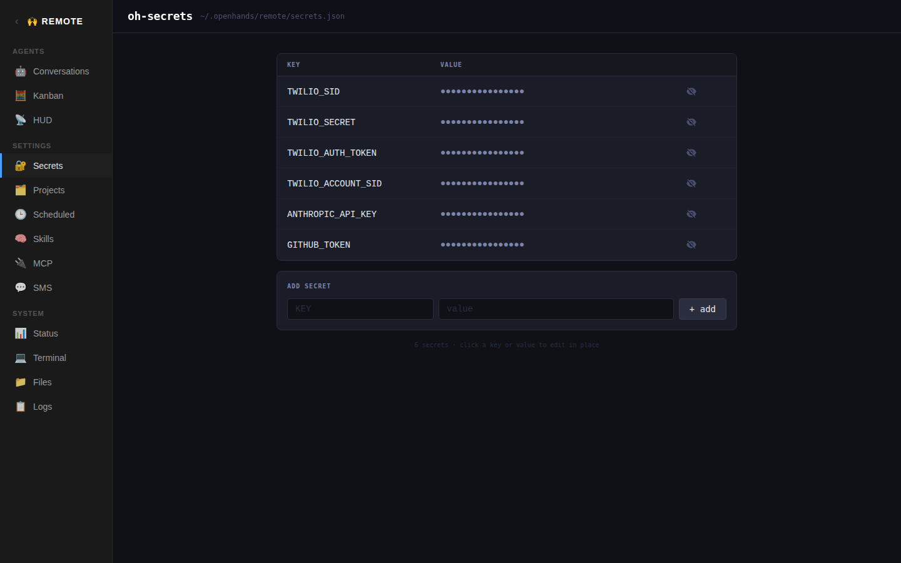

### Projects

Git repository overview for all projects under `~/git/`.

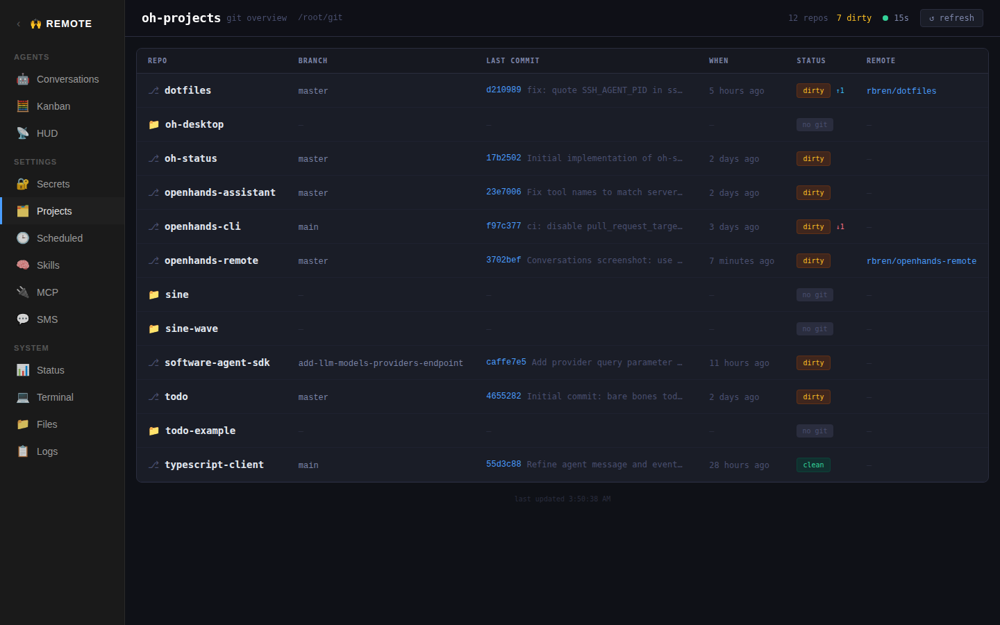

### Scheduled

Cron-based scheduler that launches agent conversations on a timer.

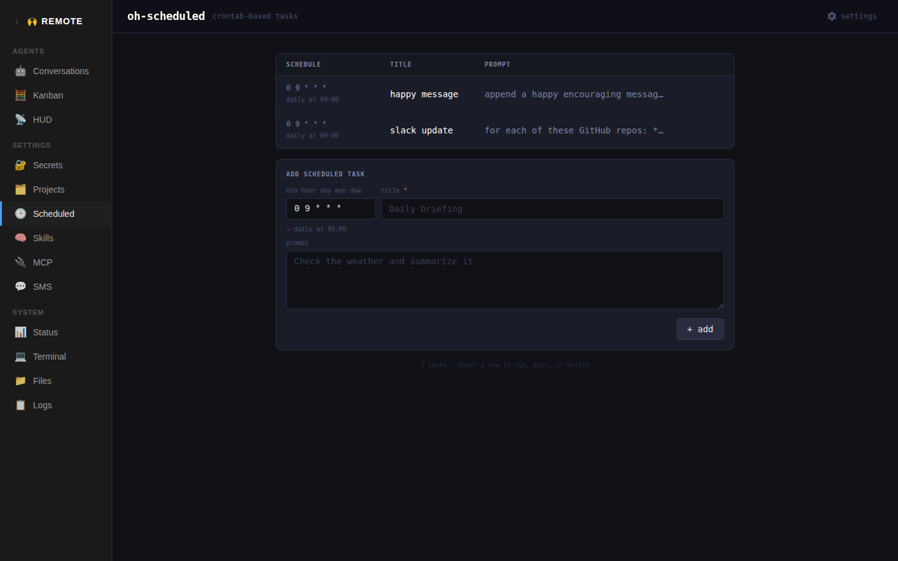

### Skills

CRUD editor for agent skills stored in the agentskills.io format.

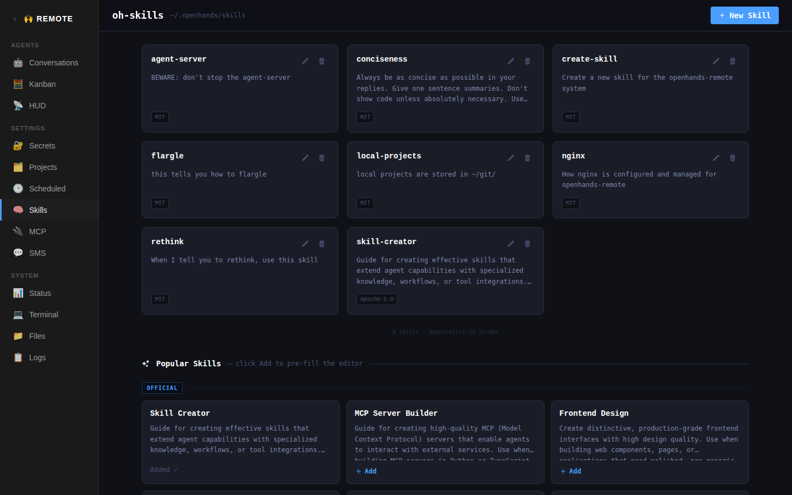

### MCP

Configuration editor for Model Context Protocol servers.

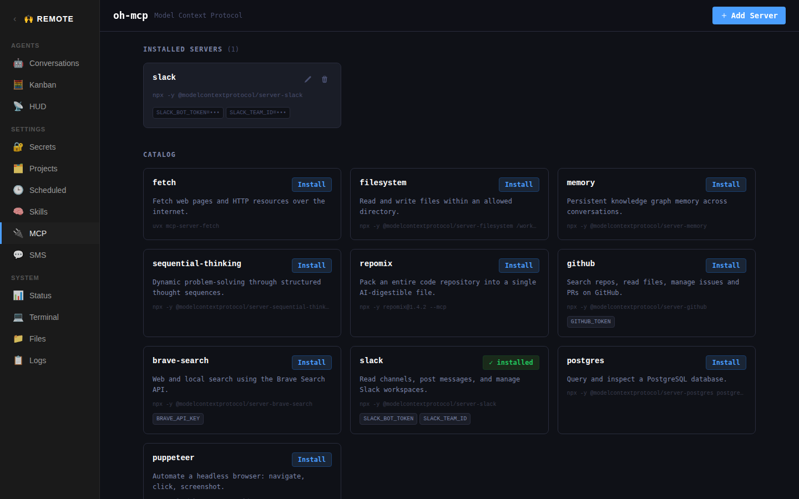

### SMS

Twilio webhook that creates agent conversations from incoming text messages.

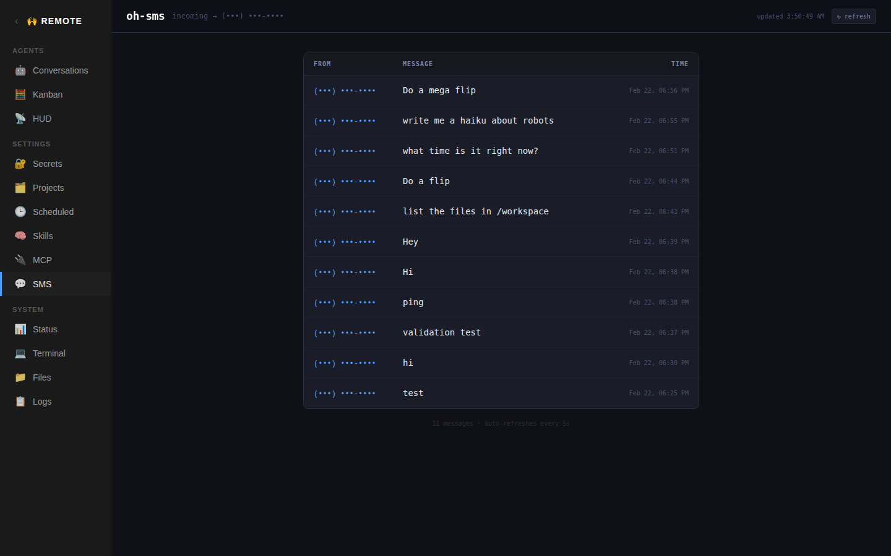

### Status

Live system monitor showing CPU, memory, disk, processes, and network.

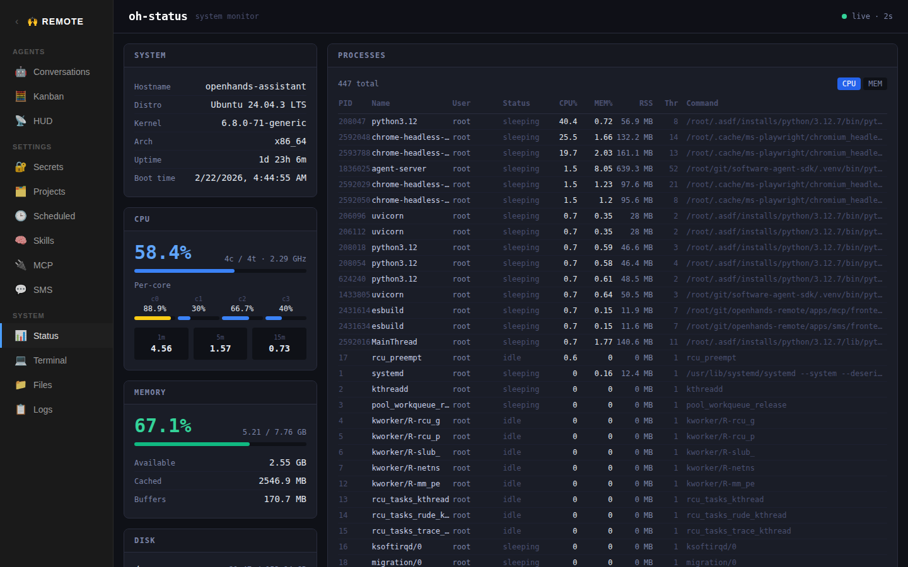

### Terminal

Multi-tab browser terminal backed by real PTY processes.

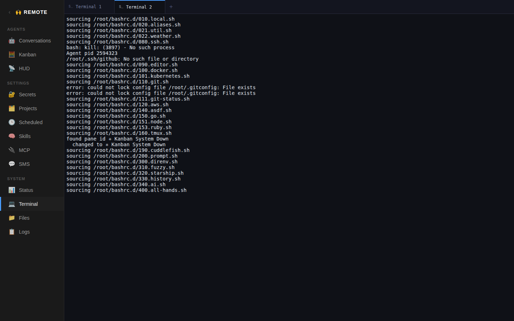

### Files

File browser and text editor for the server's filesystem.

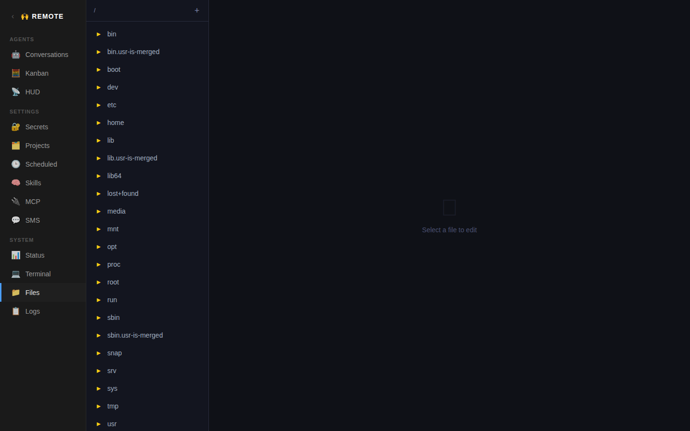

### Logs

Log viewer with live tailing and syntax highlighting.

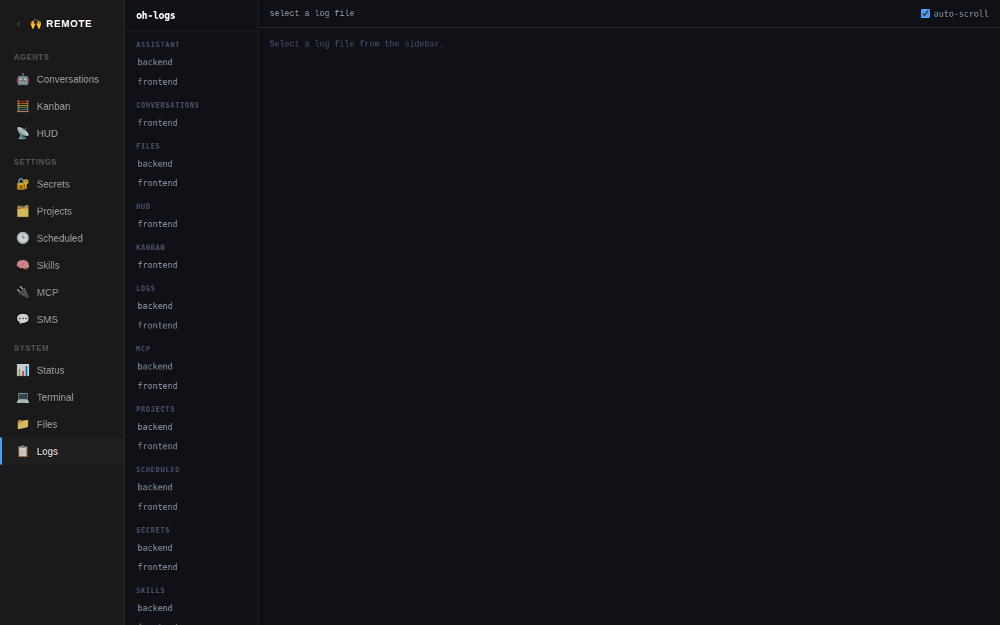
