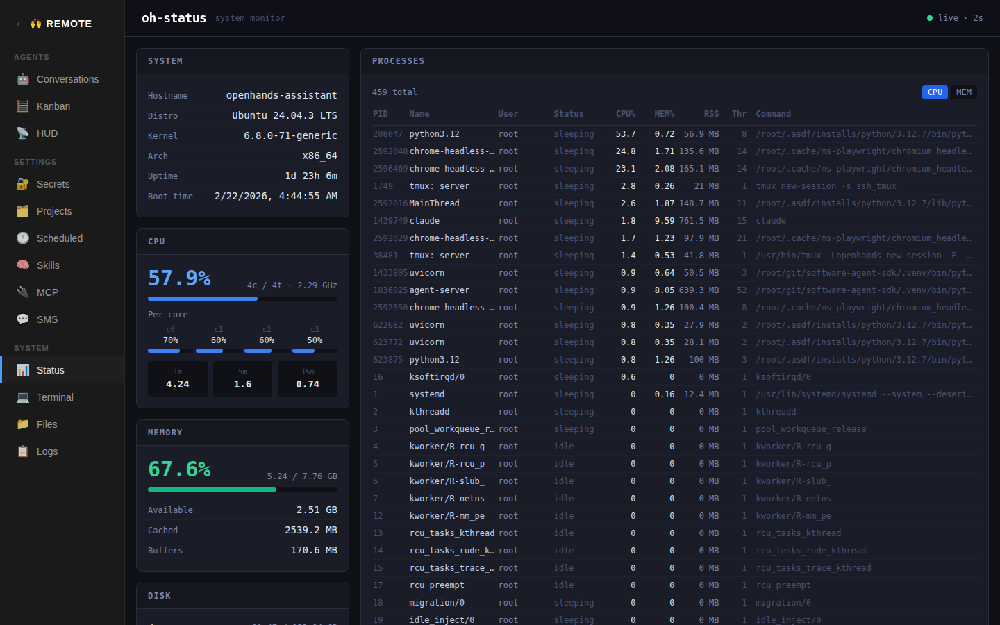

# Architecture

OpenHands Remote is a self-hosted dashboard for managing an [OpenHands](https://github.com/All-Hands-AI/OpenHands) AI agent server. It runs on a single Linux host at `https://your-domain.example.com` and presents a suite of micro-apps through a unified web UI.



## High-Level Layout

```
Browser (HTTPS :443)
  └─ nginx (reverse proxy + static files + TLS termination)
       ├─ /                      → homepage/index.html (app shell)
       ├─ /apps/<name>/          → Vite dev server (frontend, localhost:<port>)
       ├─ /apps/<name>/api/      → FastAPI (backend, localhost:<port>)
       └─ /apps/conversations/api/ → OpenHands agent-server (localhost:4004)
```

All traffic enters through nginx on ports 80/443. HTTP redirects to HTTPS. Internally, every service communicates over plain HTTP on localhost.

The OpenHands agent server (port 4004) is the backend for all conversation-related apps. See [`prompts/agent-server.md`](agent-server.md) for full API documentation, configuration, event types, and TypeScript client usage.

## Homepage Shell

`homepage/index.html` is a single-page app shell that contains:

- A collapsible left sidebar with nav links grouped into **Agents**, **Settings**, and **System** sections.
- A set of hidden `<iframe>` elements, one per app. Clicking a nav item shows the corresponding iframe and lazy-loads its `src` on first activation.
- URL routing: paths like `/conversations`, `/status`, `/files`, etc. all serve `index.html` via nginx, and the shell JavaScript activates the matching iframe.
- The conversations app communicates with the parent shell via `postMessage` to keep the browser URL in sync when navigating between conversations.

## App Pattern

Each app lives in `apps/<name>/` and follows a consistent structure:

### Frontend

- **Stack:** React + Vite + Tailwind CSS
- **Location:** `apps/<name>/frontend/` (or app root for conversations/hud/kanban)
- **Entry point:** `src/App.jsx` (or `.tsx` for TypeScript apps)
- **Vite config:** `base: '/apps/<name>/'`, dev server on an assigned port
- **Dark theme:** background `#0f1117`, borders `#2a2d3e`, text `#e2e8f0`
- All API calls go to `/apps/<name>/api/...` (relative, proxied by nginx)

### Backend

- **Stack:** Python FastAPI + uvicorn
- **Location:** `apps/<name>/backend/main.py`
- **All routes prefixed** with `/api/`
- **CORS:** `allow_origins=["*"]`

### start.sh

Each app has a `start.sh` that launches the backend (uvicorn) and frontend (npm run dev) as background processes, writes logs to `/root/git/openhands-remote/logs/`, and traps signals for clean shutdown.

## Port Assignments

| App           | Frontend | Backend |
|---------------|----------|---------|
| status        | 4001     | 4002    |
| conversations | 4003     | 4004    |
| files         | 4005     | 4006    |
| projects      | 4007     | 4008    |
| secrets       | 4009     | 4010    |
| scheduled     | 4011     | 4012    |
| terminal      | 4013     | 4014    |
| skills        | 4015     | 4016    |
| logs          | 4017     | 4018    |
| sms           | 4019     | 4020    |
| hud           | 4021     | —       |
| mcp           | 4022     | 4023    |
| kanban        | 4025     | —       |

## Shared Dependencies

Several apps share code via Vite aliases:

- **`@openhands/typescript-client`**: A local build of the [OpenHands TypeScript client](https://github.com/openhands/typescript-client) at `~/git/typescript-client/dist/`. Used by conversations, hud, and kanban for talking to the agent server. See [`prompts/agent-server.md`](agent-server.md) for API details and the typescript-client's [`frontend.md` skill](https://github.com/OpenHands/typescript-client/blob/main/.agent/skills/frontend.md) for React integration patterns.
- **`@assistant`**: Points to `apps/conversations/src/` — allows hud and kanban to import conversation hooks and components.
- **`@hud`**: Points to `apps/hud/src/` — allows kanban to import HUD hooks and components.

## Data Storage

Most app state is stored as JSON files under `~/.openhands/remote/`:

| File | Used by |
|------|---------|
| `secrets.json` | Secrets app; also injected into conversations by SMS and Scheduled apps |
| `assistant-settings.json` | Scheduled, SMS, Conversations — stores `agentServerUrl`, `model`, `apiKey`, `sessionKey` |
| `mcp.json` | MCP app — stores MCP server configurations |
| `sms-messages.json` | SMS app — log of received SMS messages |
| `scheduled-prompts/` | Scheduled app — prompt text files referenced by crontab entries |

Skills are stored in `~/.openhands/skills/<name>/SKILL.md`.

## nginx

**Config:** `/root/git/openhands-remote/nginx.conf`

nginx is started with a custom config (not the system default):

```bash
nginx -c /root/git/openhands-remote/nginx.conf
```

Key behaviors:

- **HTTP → HTTPS redirect** on port 80 (except `/.well-known/acme-challenge/` for cert renewal)
- **SSL termination** with Let's Encrypt certificates at `/etc/letsencrypt/live/your-domain.example.com/`
- **Basic auth** on all routes (see below), except `/apps/sms/api/` which is open for Twilio webhooks
- **WebSocket support** for terminal and conversations backends (proxy headers `Upgrade` + `Connection`)
- **`merge_slashes off`** so file paths like `//tmp/file` pass through correctly
- **Proxy timeout** of 3600s for the terminal WebSocket connection
- Each app gets two `location` blocks: one for the frontend (Vite dev server) and one for the backend API

### Docker mode

A separate `docker-nginx.conf` serves pre-built static assets from `dist/` directories instead of proxying to Vite dev servers. The conversations API proxy is injected at runtime via `sed` when `AGENT_SERVER_URL` is set.

## SSL / TLS

- **Provider:** Let's Encrypt via certbot
- **Issued with:** `certbot certonly --webroot -w /root/git/openhands-remote/homepage -d your-domain.example.com`
- **Certificates:** `/etc/letsencrypt/live/your-domain.example.com/{fullchain,privkey}.pem`
- **Renewal:** Automatic via certbot systemd timer; `certbot renew --dry-run` to verify
- **Protocols:** TLSv1.2, TLSv1.3; ciphers `HIGH:!aNULL:!MD5`

## Basic Auth

All HTTPS routes are protected by HTTP Basic Authentication at the nginx level:

```nginx
auth_basic           "Restricted";
auth_basic_user_file /etc/nginx/.htpasswd;
```

- **Credentials file:** `/etc/nginx/.htpasswd` (managed with `htpasswd` from `apache2-utils`)
- **Exception:** `/apps/sms/api/` has `auth_basic off` so Twilio webhooks can reach the SMS backend
- Changes to `.htpasswd` take effect on the next request — no nginx reload needed

## fail2ban

Brute-force protection for the basic auth:

- **Config:** `/etc/fail2ban/jail.d/nginx-http-auth.conf`
- **Filter:** `nginx-http-auth` (built-in, matches auth failures in nginx error log)
- **Log path:** `/var/log/nginx/error.log`
- **Backend:** `polling` (nginx is not managed by systemd)
- **Thresholds:** 5 failures in 10 minutes → IP banned for 1 hour via iptables

```bash
fail2ban-client status nginx-http-auth   # check jail status
fail2ban-client set nginx-http-auth unbanip <IP>  # unban
```

## Chromium

Chromium is required by the OpenHands agent-server's browser tool (backed by [browser-use](https://github.com/browser-use/browser-use) + Playwright). It is also useful for taking screenshots of the apps (e.g., for documentation).

- **Installed via:** `uvx playwright install chromium --with-deps` (run from `~/git/software-agent-sdk`)
- **Location:** `~/.cache/ms-playwright/chromium-*/chrome-linux64/chrome`
- **Root mode:** When the agent-server runs as root, it automatically adds `--no-sandbox` to the Chromium launch args
- The `--with-deps` flag installs system libraries (libx11, fonts, xvfb, etc.) needed by headless Chromium

To install or update:

```bash
cd ~/git/software-agent-sdk
uvx playwright install chromium --with-deps
```

## Docker

The project can also run as a Docker container (`Dockerfile`):

1. Builds all frontends to static assets
2. Starts all FastAPI backends via `docker-entrypoint.sh`
3. Serves static frontends from `dist/` directories via nginx (no Vite dev servers)
4. `AGENT_SERVER_URL` env var enables the conversations API proxy at runtime
5. Runs cron for scheduled tasks
6. Exposes port 80 only (no SSL — intended to sit behind an external reverse proxy or load balancer)

## Logging

All app logs are written to `/root/git/openhands-remote/logs/`:

- `<app>-backend.log` — uvicorn/FastAPI output
- `<app>-frontend.log` — Vite dev server output

The Logs app provides a web UI to browse and tail these files.

## Gotchas

### Duplicated Conversation Configuration

Multiple apps create agent conversations independently (Conversations, Scheduled, SMS) and each one assembles the conversation payload itself — reading `assistant-settings.json`, `secrets.json`, `mcp.json`, default tool lists, etc. This means the logic for "how to start a conversation with the right config" is duplicated across all three backends. If you change how secrets are injected, add a new default tool, or alter the MCP payload shape, you need to update every app that creates conversations or they'll silently diverge. This is the biggest maintenance footprint in the project and a likely source of subtle bugs.

## Security

This machine has full shell access exposed through web UIs, APIs, and an AI agent that can execute arbitrary code. If an attacker gets in, they own everything.

**Assume the machine is a target and lock it down accordingly:**

- **Firewall / IP allowlisting:** Only permit inbound connections from known IPs. All major cloud providers support security groups or firewall rules — use them. Block everything by default and allowlist your home IP, VPN, etc.
- **HTTP basic auth:** nginx is configured with `auth_basic` on all routes by default. Use a strong password. The only route that bypasses auth is the Twilio SMS webhook, which validates requests via Twilio's signature.
- **fail2ban:** Configured to watch nginx auth logs and ban IPs after repeated failed login attempts.
- **Minimize exposed secrets:** Be deliberate about what API keys and MCP servers you give to the agent. Even with the network locked down, a prompt-injection attack via a malicious webpage could cause the agent to exfiltrate secrets or take unwanted actions.
- **No public exposure without protection:** Do not expose this machine to the open internet without at least basic auth and a firewall. Preferably both.
