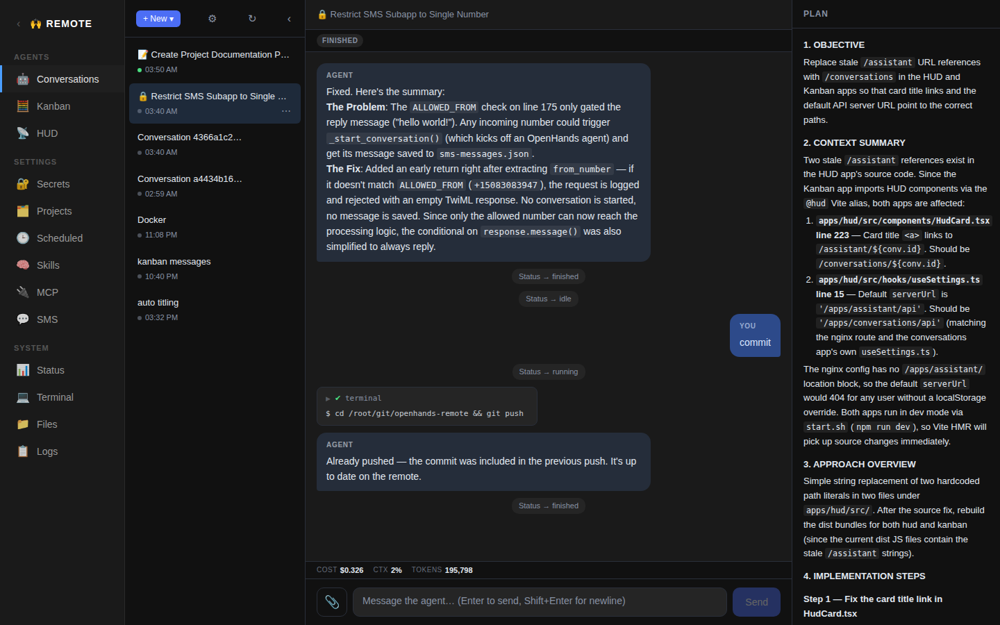

# Code App (Conversations)



Chat UI for interacting with OpenHands agent conversations. This is the primary app for coding tasks — it creates, lists, and streams conversations running on the OpenHands agent server. (The tab is labeled "Code" in the nav, though the app directory is still `apps/conversations/`.)

## Ports

| Component | Port |
|-----------|------|
| Frontend  | 4003 |
| Agent-server backend | 4004 (external) |
| Git backend | 4044 |

## Backend

The Code app relies on the [OpenHands agent-server](https://github.com/All-Hands-AI/OpenHands) from the `software-agent-sdk` project, running on port 4004. It also has its own lightweight **git backend** on port 4044.

### Starting the Agent Server

```bash
cd ~/git/software-agent-sdk
OH_SESSION_API_KEYS_0=your-session-key OH_ALLOW_CORS_ORIGINS='["*"]' uv run agent-server --port 4004
```

- `OH_SESSION_API_KEYS_0` — session API key for authentication
- `OH_ALLOW_CORS_ORIGINS` — CORS whitelist

### Git Backend

**File:** `apps/conversations/backend/main.py`
**Stack:** FastAPI + uvicorn

A small backend that exposes git status and diff information for the working directory of the currently selected conversation.

| Method | Path | Description |
|--------|------|-------------|
| `GET` | `/api/git/status?path=...` | Returns branch name, changed files (porcelain format), ahead/behind counts |
| `GET` | `/api/git/diff?path=...&file=...` | Returns the diff for a specific file (unstaged, staged, or raw content for untracked files) |

### nginx Proxy

Three location blocks:
- `/apps/conversations/api/` → `http://127.0.0.1:4004/` (agent-server, with WebSocket upgrade headers)
- `/apps/conversations/git/` → `http://127.0.0.1:4044/` (git backend)
- `/apps/conversations/` → Vite dev server on port 4003

### Chromium

The agent server includes a browser tool backed by Playwright. Chromium must be available (installed via `uvx playwright install chromium --with-deps --no-shell`). When running as root, the server automatically adds `--no-sandbox`.

## Frontend

**Directory:** `apps/conversations/` (app root, not in a `frontend/` subdirectory)
**Stack:** React + Vite + TypeScript
**Dependencies:** `@openhands/typescript-client` (local build from `~/git/typescript-client`)

### Vite Config

```ts
base: '/apps/conversations/',
port: 4003,
resolve.alias: {
  '@openhands/typescript-client': '/root/git/typescript-client/dist/index.js',
  '@shared': '../shared',  // shared components and hooks
},
optimizeDeps.exclude: ['@openhands/typescript-client'],
```

The local typescript-client is excluded from pre-bundling so Vite uses the pre-built dist as-is.

### Source Structure

```
src/
  App.tsx              — main layout: sidebar + chat + right pane (controls + git)
  main.tsx             — React entry point
  constants.ts         — default tool list (includes planning_file_editor, delegate)
  components/
    ControlBar.tsx     — collapsible control bar with plan/verify/save sliders
    GitPane.tsx        — git status panel showing branch, changes, diffs
    PlanPane.tsx       — floating pane showing the agent's PLAN.md
  hooks/
    useControlSettings.ts — manages control bar state, formats control messages
    useGitStatus.ts       — polls git status/diff for the conversation's working dir
  utils/
    createConversation.ts — creates conversations with controls and delegation support
```

Most shared UI components live in `apps/shared/` (see below).

### App.tsx Layout

Multi-column layout:

1. **ConversationList** (left sidebar, from `@shared`): conversation list with new chat, rename, delete, star, staleness fading. Collapsible via toggle.
2. **ChatView** (center, from `@shared`): streams conversation events in real-time. Features think bubble rendering (collapsible), action groups, image attachments.
3. **Right pane** (resizable):
   - **ControlBar** — collapsible bar with plan/verify/save slider controls
   - **GitPane** — git status for the conversation's working directory (branch, changed files, inline diffs, commit/pull/push action buttons)
4. **PlanPane** (floating): displays the contents of `PLAN.md` from the conversation's plan directory.

### Control Bar

The control bar provides three slider controls that set preferences for how the agent works:

| Control | Options | Default | Description |
|---------|---------|---------|-------------|
| Plan | none / some / lots | some | How much up-front planning before coding |
| Verify | none / some / lots | some | How thoroughly to verify changes |
| Save | none / commit / PR / main | commit | How to persist changes (git strategy) |

Controls are communicated to the agent via:
1. **`system_message_suffix`** — injected into the conversation's `agent_context` at creation time
2. **First message** — if non-default, appended to the first user message as `[Agent Controls Update]`
3. **Mid-conversation changes** — sent as a standalone `[Agent Controls Update]` message when sliders change

Controls reset to defaults when switching conversations.

### Git Status Panel

The git pane shows:
- **Branch bar** — current branch, ahead/behind counts
- **Action buttons** — Commit, Pull, Push (highlighted when relevant, e.g. Push shows count when ahead)
- **Changed file list** — color-coded by status (M=modified, A=added, D=deleted)
- **Inline diff viewer** — click a file to see its diff with syntax highlighting

Clicking an action button sends a natural-language instruction to the agent as a chat message (e.g. "Commit all current changes with a descriptive commit message").

### Conversation List Features

The conversation list (from `@shared`) includes:
- **Star functionality** — star/unstar conversations; starred items sort to the top
- **Staleness fade** — conversation items fade to lower opacity based on time since last activity (hyperbolic decay)
- **Inactive hiding** — conversations with no activity for 3+ hours are hidden by default; "show all" link reveals them
- **Bulk delete** — "delete inactive" option for cleaning up old conversations
- **Context menu** — right-click for rename/delete

### URL Routing

The app supports deep-linking to conversations:

- `/apps/conversations/` — no conversation selected
- `/apps/conversations/{id}` — specific conversation open

When **embedded** in the homepage shell (iframe):
- URL changes are communicated to the parent via `postMessage({ type: 'conversations-navigate', path })`.
- The parent pushes to browser history and relays back/forward via `postMessage({ type: 'conversations-select', id })`.

When **standalone**:
- Uses `history.pushState()` / `popstate` directly.

### Settings

LLM settings (model, API key, base URL, session key) are configured in the separate **LLM app** (`apps/llm/`, see `prompts/llm.md`), not in the Code app.

The `useSettings` hook (from `@shared`) reads settings from `localStorage` (key `openhands-chat-settings`) and listens for `storage` events so changes made in the LLM app propagate immediately across iframes without a page reload.

### Creating Conversations

`createConversation.ts` POSTs to the agent server with:
- `agent.llm` — model and API key from settings
- `agent.tools` — default tool list including `planning_file_editor` (with per-conversation plan path) and `delegate` (if agent definitions exist)
- `agent.mcp_config` — loaded from the MCP app's config endpoint
- `agent.agent_context.skills` — loaded from the skills API
- `agent.agent_context.system_message_suffix` — control bar settings
- `workspace.working_dir` — selected project directory
- `initial_message` — user's first message

If agent definitions exist (from `/apps/openhands/api/agent-definitions`), delegation is enabled by adding the `delegate` tool and passing `agent_definitions` and `tool_module_qualnames` in the request body.

After creation, secrets are injected from the secrets API.

### Shared Code (apps/shared/)

Most reusable UI components and hooks have been extracted to `apps/shared/`:

```
apps/shared/
  shared.css                    — base dark theme styles used by both Code and Vibe
  components/
    ConversationList.tsx        — sidebar conversation list
    ChatView.tsx                — message stream and input
    EventBubble.tsx             — renders individual conversation events
    ActionGroup.tsx             — collapsible group of consecutive tool actions
  hooks/
    useAgentConversation.ts     — streams events from a conversation
    useConversationList.ts      — fetches/manages conversation list
    useProjects.ts              — fetches git projects for working dir picker
    useSettings.ts              — reads/writes LLM settings from localStorage
  utils/
    conversationSetup.ts        — fetchSkills, fetchMcpConfig, fetchAgentDefinitions, applySecrets
    eventHelpers.ts             — event type helpers
    markdownComponents.tsx      — shared Markdown rendering components
```

Both the Code and Vibe apps import from `@shared` via a Vite alias. The HUD and Kanban apps also use `@shared`, plus `@assistant` (pointing to `apps/conversations/src/`) for conversations-specific hooks.
