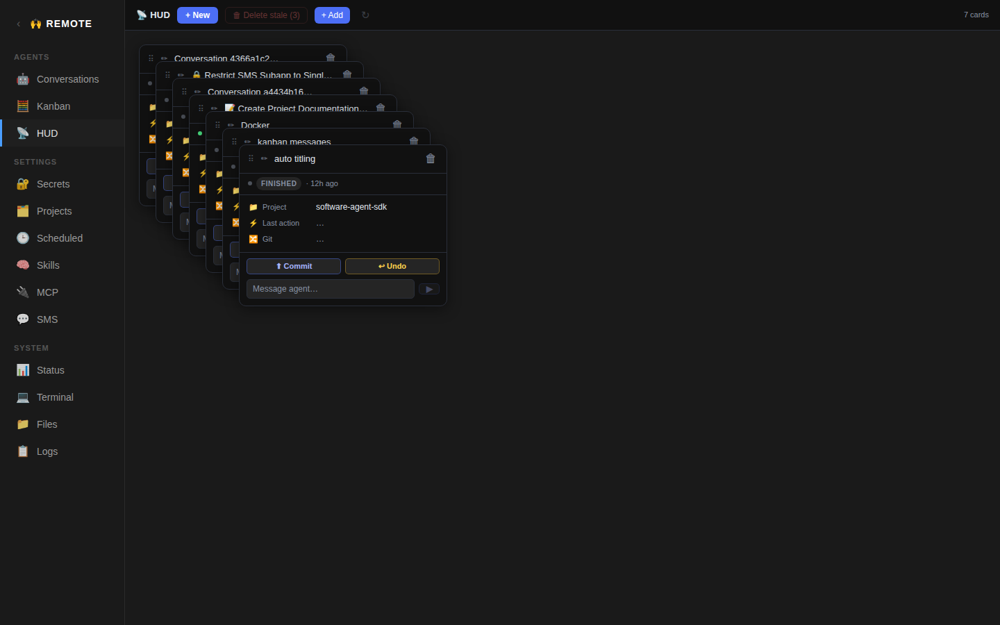

# HUD App



Heads-up display for monitoring live agent conversations. Shows conversations as draggable cards on a freeform canvas with real-time status updates.

## Ports

| Component | Port |
|-----------|------|
| Frontend  | 4021 |
| Backend   | — (uses Code backend on 4004) |

## Backend

The HUD has **no backend of its own**. It communicates directly with the OpenHands agent-server (port 4004) via the `@openhands/typescript-client` library.

## Frontend

**Directory:** `apps/hud/` (app root, no `frontend/` subdirectory)
**Stack:** React + Vite + TypeScript + Tailwind
**Dependencies:** `@openhands/typescript-client`

### Vite Config

```ts
base: '/apps/hud/',
port: 4021,
resolve.alias: {
  '@openhands/typescript-client': '/root/git/typescript-client/dist/index.js',
  '@assistant': '<...>/apps/conversations/src',
  '@shared': '<...>/apps/shared',
},
```

The `@assistant` alias allows importing hooks from the Code app. The `@shared` alias provides access to shared components and hooks (ConversationList, ChatView, useSettings, useProjects, etc.).

### Source Structure

```
src/
  App.tsx                — main app with toolbar + card rendering
  App.css                — card and toolbar styles
  shared.css             — shared styles (imported by kanban too)
  main.tsx               — React entry point
  types.ts               — shared TypeScript types
  components/
    HudCard.tsx          — individual conversation card
    ConversationPicker.tsx — dropdown to add existing conversations
    NewConversationModal.tsx — modal to start a new conversation
  hooks/
    useSettings.ts       — reads agent server URL and session key
    useConversations.ts  — fetches and filters conversation list
    useHudState.ts       — manages pinned/excluded state + card positions
    useCardActions.ts    — card action handlers (stop, resume, send message)
    useCardDetail.ts     — fetches latest events for a card
    useNewConversation.ts — creates new conversations
```

### HUD State (`useHudState`)

Persisted in `localStorage`:
- **`pinned`** — array of conversation IDs explicitly pinned to the HUD
- **`excluded`** — array of conversation IDs explicitly hidden
- **`positions`** — `{ [id]: { x, y } }` — saved drag positions for each card

Conversations appear on the HUD if they are either pinned or have status "running" (and not excluded). The state provides `pin(id)`, `exclude(id)`, `forget(id)`, and `setPosition(id, pos)` methods.

### Toolbar

- **"+ New"** button — opens the new conversation modal
- **"🗑 Delete stale (N)"** button — bulk-deletes conversations that are not running and older than 1 hour (`STALE_MS = 60 * 60 * 1000`)
- **Conversation picker** — dropdown to add an existing conversation to the HUD by pinning it
- **Refresh** (↻) button
- **Card count** display

### HudCard Component

Each card displays:
- Conversation title (or truncated ID)
- Working directory / project name
- Execution status with a colored indicator
- Latest event/activity summary
- Action buttons: stop, resume, delete
- Drag handle for repositioning on the canvas

Cards are positioned absolutely based on saved coordinates. Default positions are calculated in a grid layout.

### Conversations Hook (`useConversations`)

Fetches the conversation list from the agent server, applies the HUD state filter (pinned + running, minus excluded), and returns:
- `allConversations` — unfiltered list
- `visible` — filtered list shown on the HUD
- `loading`, `error`, `refresh`

### New Conversation Modal

Shared with the Kanban app. Lets the user:
- Enter a prompt message
- Select a working directory from the projects list (fetched via `useProjects` from `@assistant`)
- Start the conversation

### Shared Code

The HUD exports several hooks and components that the Kanban app imports via the `@hud` Vite alias:
- `useSettings`, `useConversations`, `useNewConversation`
- `HudCard`, `NewConversationModal`
