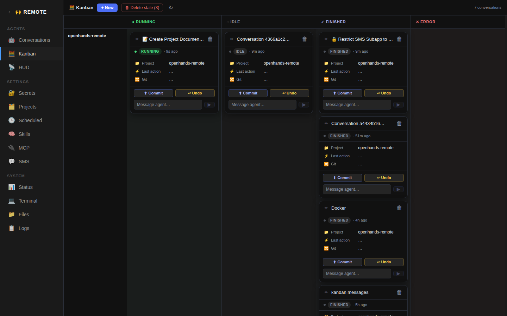

# Kanban App



Kanban board view of all agent conversations, organized into columns by status and rows by project. Provides a structured overview of conversation state across all working directories.

## Ports

| Component | Port |
|-----------|------|
| Frontend  | 4025 |
| Backend   | — (uses conversations backend on 4004) |

## Backend

The Kanban app has **no backend of its own**. Like the HUD, it talks directly to the agent-server via `@openhands/typescript-client`.

## Frontend

**Directory:** `apps/kanban/` (app root, no `frontend/` subdirectory)
**Stack:** React + Vite + TypeScript + Tailwind
**Dependencies:** `@openhands/typescript-client`

### Vite Config

```ts
base: '/apps/kanban/',
port: 4025,
resolve.alias: {
  '@openhands/typescript-client': '/root/git/typescript-client/dist/index.js',
  '@hud': '<...>/apps/hud/src',
  '@shared': '<...>/apps/shared',
  '@assistant': '<...>/apps/conversations/src',
},
```

The `@hud` alias imports HUD hooks and components; `@shared` provides shared components and hooks; `@assistant` imports conversations-specific hooks.

### Source Structure

```
src/
  App.tsx              — main kanban board
  App.css              — kanban grid and column styles
  main.tsx             — React entry point
  hooks/
    useCardFLIP.ts     — FLIP animation hook for card transitions
```

### Imported from HUD (`@hud`)

- `useSettings` — agent server URL + session key
- `useConversations` — conversation list fetching
- `useNewConversation` — conversation creation
- `HudCard` — individual conversation card component
- `NewConversationModal` — new conversation dialog

### Imported from Conversations (`@assistant`)

- `useProjects` — git project list for project-row labels and the new conversation modal

### Kanban Layout

The board is a CSS grid with:
- **Columns**: `running`, `idle`, `finished`, `error`
- **Rows**: one per project (git repo), plus "Unknown" for conversations without a recognized working directory

#### Column Headers

```
● Running  |  ◌ Idle  |  ✓ Finished  |  ✕ Error
```

#### Status Normalization

`normalizeStatus()` maps execution statuses to columns:
- `"running"` → running
- `"finished"` → finished
- `"error"`, `"stuck"`, `"deleting"` → error
- Everything else (`"idle"`, `"paused"`, `"waiting_for_confirmation"`, unknown) → idle

#### Project Resolution

`resolveProject()` matches a conversation's `workspace.working_dir` against the projects list. If a project's `path` is a prefix of the working dir, the project name is used as the row label. Otherwise, the raw path is shown, or "Unknown" if no working dir is set.

### Building the Grid

`buildKanban(conversations, projects)` produces:
- `grid: { [projectName]: { running: [], idle: [], finished: [], error: [] } }` — conversations bucketed by project and status
- `projectRows: string[]` — sorted project names ("Unknown" sorted last)

### FLIP Animations (`useCardFLIP`)

When conversations change columns (e.g., running → finished), cards animate smoothly using the FLIP technique:

1. Before render: record each card's bounding rect
2. After render: record new bounding rects
3. Calculate deltas and apply CSS transform + transition to animate from old position to new

The `cardRef(id)` function returns a callback ref that registers each card DOM node.

### HUD State Stub

The Kanban board shows **all** conversations unconditionally (no pinning/excluding). It passes an empty `HudState` stub to `useConversations`:

```ts
const EMPTY_HUD_STATE: HudState = {
  pinned: [], excluded: [], positions: {},
  pin: () => {}, exclude: () => {}, forget: () => {},
  setPosition: () => {}, getDefaultPosition: () => ({ x: 0, y: 0 }),
};
```

### Toolbar

- **"+ New"** — opens `NewConversationModal`
- **"🗑 Delete stale (N)"** — bulk-deletes non-running conversations older than 1 hour
- **Refresh** (↻) button (debounced: disabled while loading)
- **Error indicator** if fetching fails
- **Conversation count** display

### Delete Handling

Deletes are deferred if a refresh is in-flight, using a `pendingDeletesRef` queue that flushes when `loading` becomes false. This prevents race conditions between delete operations and list refreshes.

### Cards

Each conversation is rendered as a `HudCard` (from `@hud`), wrapped in a div with a FLIP ref. Cards don't have drag-and-drop in the kanban view (positions are determined by the grid), but retain their HUD styling and action buttons (stop, resume, delete).
